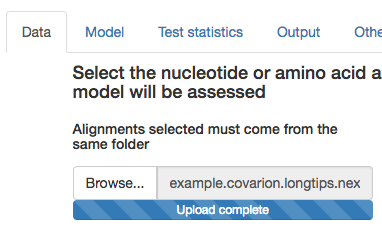
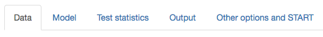
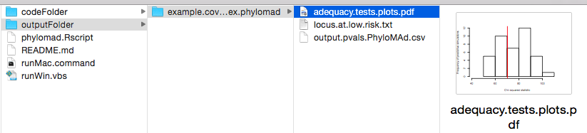
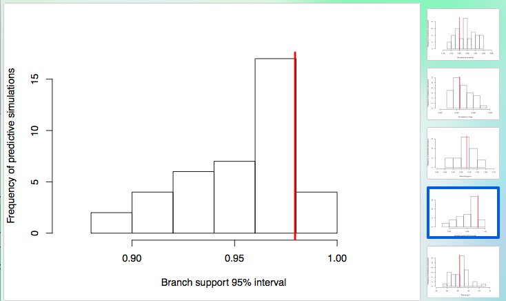
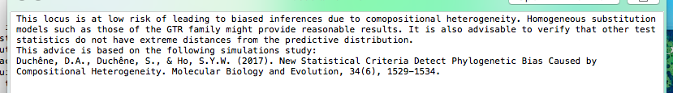
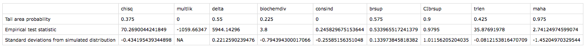

For support contact David A. Duchêne
david.duchene[at]sydney.edu.au

23 May 2017

## Introduction

This repository contains PhyloMAd, a software for easily-accessible assessment of phylogenetic model adequacy.

Copyright 2017 by the PhyloMAd authors. The software PhyloMAd is distributed without warranty of any kind or support for previous versions. The authors will not be responsible for any damage resulting from the use of this software. The source and documentation are distributed under the GNU General Public Licence except where stated otherwise. See http://www.opensource.org/licenses for details.

Substitution models supported inlcude the JC, HKY, and GTR models, including gamma-distributed rates across sites with 4 discrete categories. Clock models supported include those implemented in BEAST 2.

## Download and package installation

PhyloMAd requires that the R statistical computing language is installed. R is freely available from the R project website.

https://www.r-project.org/

Download and unzip the PhyloMAd repository from GitHub. This can be done by pressing the *Clone or download* button above or by typing the following in a bash shell. The later option assumes that the machine has git installed.

```coffee
git clone https://github.com/duchene/modadclocks.git
```

Double-click the PhyloMAd file according to the platform (runMac.command or runWin.vbs). Opening the package for the first time might take several minutes and can require internet connection. This is because PhyloMAd will check that all the required R packages are installed, and then it will install them if needed.

If you have difficulty opening the program, you might want to try opening a bash shell, setting your directory to the PhyloMAd folder and executing the R script by hand.

```coffee
cd pathToPyloMAd
Rscript phylomad.Rscript
```

In mac machines, PhyloMAd will open a terminal window when opened and log the progress. In windows, a log file with the progress will be saved in the main PhyloMAd folder. This log file is mainly useful for checking progress, so it is safe to delete it when the program is closed.

Once you have opened PhyloMAd, select the model you wish to assess from the buttons at the left of the screen.

## Brief tutorial 

This is a brief tutotrial for assessing substitution model adequacy in a single locus. Refer to the manual for more detailed settings.

### User interface

After selecting a model from the box to the left, you will see a corresponding set of tabs in the main screen ranging from *Data* to *Other options and START*.

You can go through the tabs before modifying the settings to make sure you understand them. Further information about each of the options can be found in the manual.

1. For a quick trial of the software, press *Browse* in the Data tab under the *Select nucleotide or amino acid alignment* header.

Browse through your files into the *phylomad* folder, then the *codeFolder*, and the *exampleData* folder, and select the data set called *example.covarion.longtips.nex*. If you have selected the file successfully, the PhyloMAd window should say *Upload complete*.



2. You can now read through the other options without changing anything. Browse through each of the tabs entitled *Model*, *Test statistics*, and *Output*, making sure you understand what the settings mean, and referring to the manual for any further details.



3. Once you get to the *Other options and START* tab, you can reduce the number of simulations to 40, since this is only a test run. If possible, check whether your machine has multiple cores and increase the number in the corresponding section to 4 cores.

Now press the *START ASSESSMENT* button. 


You can monitor the assessment in the shell (mac) or checking the log file that is created in the main PhyloMAd folder (windows). Also check the output folder and make sure that data are being stored and removed as successive simulations are analyzed.

### Interpreting output

In this example, the output folder was kept as the default. This means that the output will have been saved in the *outputFolder*, which is in the main PhyloMAd folder.

Inside the output folder, there will be a separate folder containing the output for each locus for which the model was assessed. In the case of this example, there will be a single folder containing three files. 



One is a PDF with histograms of the values of the test statistics calculated from simulated data, with the value calculated for the empirical data set shown in a red line. These graphics are useful for qualitative interpretation of the results. This qualitative interpretation is necessary for most of the test statistics until they are better understood.



Next is a file with an interpretation of the test for the chi-squared test for non-stationarity. This test has been explored in detail in a previous study. According to the thresholds investigated in that study, the test allows for interpretation of the results. 



In this example the test tells us that the amount of compositional heterogeneity is unlikely to be of concern.

The last file is a table that shows three values (rows) for each test statistic selected (columns). These three values include: 

- The tail area probability, which is the proportion of values calculated for simulations that are lower than the value calculated for the empirical data set; 

- The statistic calculated for the empirical data set;

- The distace between the empirical data set and the mean of the simulated distribution in terms of the number of standard deviations of the distribution.



In this example that the multinomial statistic is not available for analysis. This is probably because this data set comes from a scenario with extremely long terminal branches. The high divergence among taxa has led to every site having a different pattern in every data set, so every simulated data set has the same multinomial likelihood as the empirical data set. This test statistic is not useful in this scenario.